# Trabalho de Implementação - Parte 1

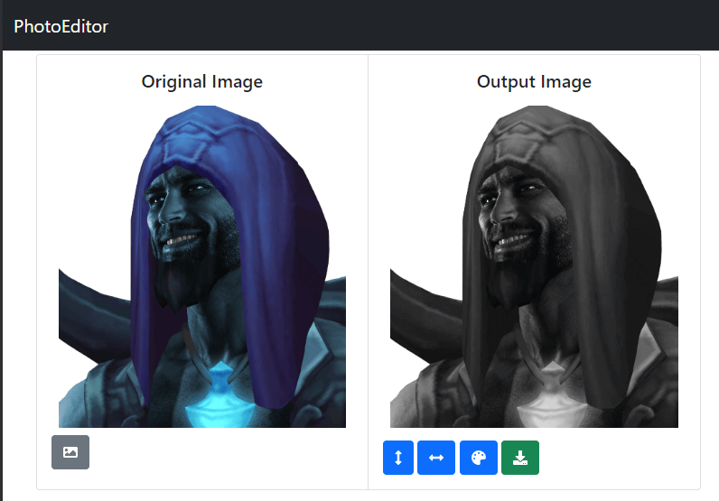

**Disciplina:** INF01046 – Fundamentos de Processamento de Imagens

**Professor:** Manuel M. Oliveira

**Aluna:** Lucina de Oliveira  
**Matrícula UFRGS:** 278301

## Introdução

Este relatório descreve a implementação da primeira parte do projeto, utilizando tecnologias como o framework React em conjunto com a linguagem Typescript. Além disso, a biblioteca Bootstrap e FontAwesome foram adotadas para aprimorar a experiência do usuário (UX). Para a manipulação e leitura de arquivos de imagem, foi empregada a biblioteca OpenCV.

Apesar de as linguagens recomendadas para o projeto terem sido C++ e C, em razão de sua eficiência, optei pelo uso do framework React por vários motivos específicos:

### Motivações para a escolha do framework React:

1. **Portabilidade**

   A capacidade de compatibilidade com navegadores torna o JavaScript altamente portável, permitindo a execução em qualquer dispositivo com um navegador. O projeto está disponível em [PhotoEditor](https://luci-dot-exe.github.io/photo-editor/), acessível sem necessidade de qualquer configuração adicional.

2. **Facilitação de futuras extensões do projeto**

   Planejo ampliar as funcionalidades do projeto mesmo após a conclusão do curso. Utilizar um ambiente de desenvolvimento que não exija muita preparação facilitará o suporte futuro.

3. **Performance satisfatória**

   Todas as funcionalidades requeridas pelo projeto foram executadas em poucos segundos para todas as imagens fornecidas nos testes. Apesar de não ter a mesma performance de uma linguagem compilada, a aplicação é suficientemente eficiente, sem causar frustração ao usuário. Também existem diversas maneiras de aprimorar a performance da aplicação atual, mesmo em JavaScript, caso seja necessário.

4. **Opção de cálculo server-side**

   No caso de necessidade de maior desempenho e nenhuma melhoria viável na aplicação, os cálculos podem ser transferidos para o servidor, podendo ser implementados em qualquer linguagem compilada.

## Parte I – Leitura e Gravação de Arquivos de Imagens

> Escreva um programa para ler arquivos de imagens e regravá-los com um outro nome.
>
> Esta tarefa simples tem o objetivo de familiarizá-la(o) com o uso de bibliotecas para leitura e gravação de arquivos.
>
> O seu programa deve suportar pelo menos o formato JPEG.  
> Teste o seu programa com imagens JPEG (e.g., utilize as imagens disponibilizadas para o trabalho).

A leitura e gravação de arquivos de imagem em páginas HTML é bem simples.

Para a leitura, o seguinte componente HTML é utilizado: `<input type="file"/>`. Esse componente utiliza a API do dispositivo para realizar o carregamento de arquivos. Usando o atributo `accept="image/*"` é especificado que apenas arquivos de imagem serão aceitos pela aplicação.

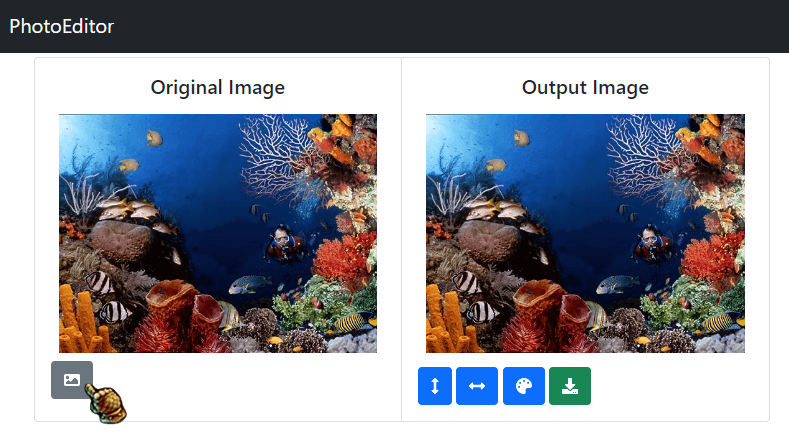

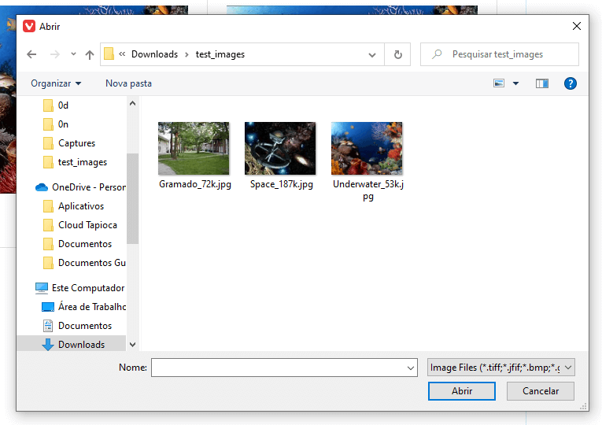

Para a gravação, é utilizado o componente HTML `<a />`. Esse componente possui um atributo chamado `href` que aponta para um arquivo. Uma vez clicado, o browser utilizado irá baixar o arquivo que está apontado pelo componente.

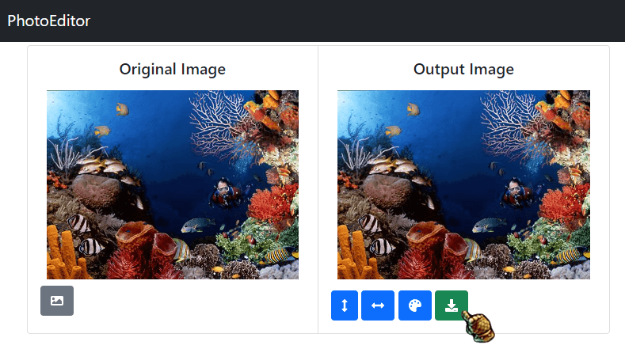

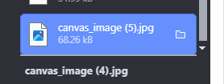

No entanto, o arquivo lido não é passado direto para o componente de gravação. Antes disso, ele passa pelo OpenCV que aplicará as transformações selecionadas pelo usuário. A biblioteca OpenCV é adicionada através do seguinte componente: `<script async src="https://docs.opencv.org/master/opencv.js" type="text/javascript"></script>`. O que esse componente faz é carregar a biblioteca OpenCV.js direto do servidor do OpenCV e disponibiliza ela na aplicação.

> Para essas imagens, verifique seus tamanhos em cada imagem do par (original e arquivo gravado).
> Você percebe alguma diferença visual entre elas?

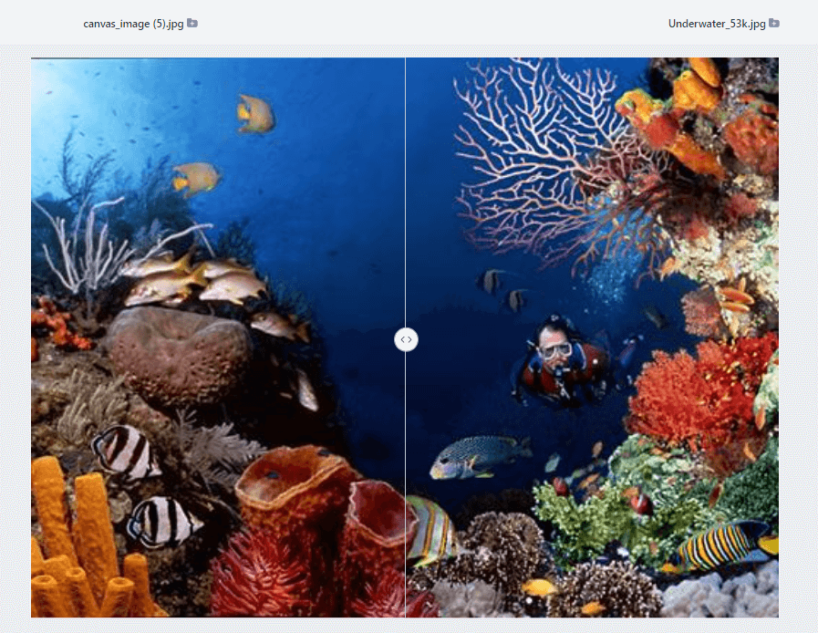
Utilizando o site https://www.diffchecker.com/image-compare/, nenhuma mudança visual fica aparente. Além disso, o tamanho das imagens também são iguais.

> Alguma diferença nos tamanhos dos arquivos? Caso haja diferença nos tamanhos de arquivos, faça uma pequena pesquisa na web sobre arquivos JPEG e tente explicar a causa da diferença observada.

O arquivo escolhido Underwater possui 53 kbytes em sua versão original e sua cópia possui 68 kbytes. Acredito que essa mudança seja devido a seu algoritmo de compressão do JPEG e por isso possui um tamanho maior embora continue visualmente igual.

## Parte II – Leitura, Exibição e Operações sobre Imagens

> Nessa etapa, estaremos aplicando algumas operações sobre imagens.
> Para tanto, estenda o programa que você desenvolveu na Parte I para exibir as imagens lidas e utilize alguma ferramenta/toolkit para fazer a gerência de janelas para você.
>
> O seu programa deve exibir duas janelas separadas (ou duas imagens lado a lado em uma mesma janela).
> Mostre a imagem original à esquerda, e o resultado da operação realizada sobre ela à direita.

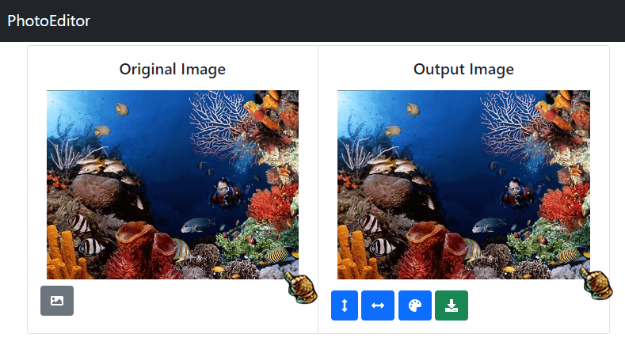

Em HTML, o componente `` é responsável por realizar a exibição de arquivos de imagem e por isso, a implementação da exibição da imagem original foi relativamente simples. A imagem de output, no entanto, foi um pouco mais complexa. A biblioteca OpenCv exige que o output da imagem computada seja mostrada em um componente `<canvas />` o que complicou um pouco.

### Espelhamento horizontal e vertical da imagem original

> Ao espelhar (verticalmente/horizontalmente) a imagem um número par de vezes, você deverá obter a imagem original.

> Procure implementar estas operações de modo eficiente (dica: considere o uso do comando memcpy) sempre que possível, ao invés de trocar um par de pixels por vez.

> Certifique-se de que a operação funciona para imagens tanto com número par como com número ímpar de linhas e colunas.

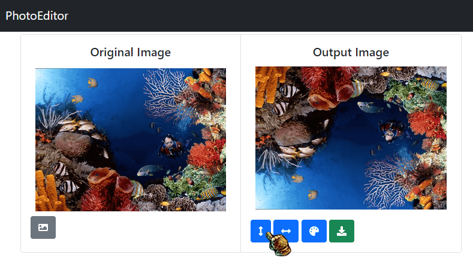

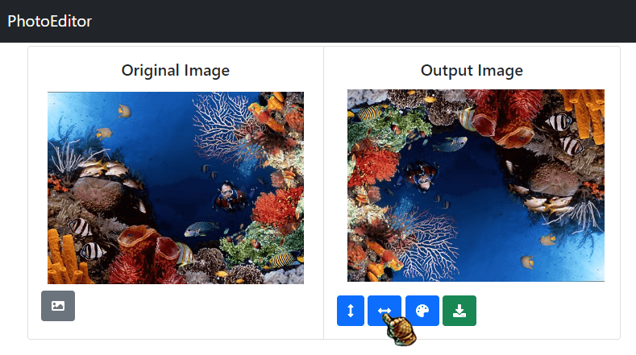

```typescript
// iteração sob os dados da imagem
const target = mat.data.map((_, index, source) => {
  // calcula as coordenadas do pixel a partir do index
  const coordinates = index2Coordinates(index);

  // calcula as coordenadas do pixel que deveria estar no lugar dele
  const srcIndex = coordinates2Index({
    ...coordinates,
    row: mat.rows - coordinates.row - 1,
  });

  // retorna o pixel correto
  return source[srcIndex];
});

// atualiza os dados da imagem
mat.data.set(target, 0);
```

Esse algoritmo funciona pois o Javascript sempre fornece o array original no método `map`, então assim é possível calcular o pixel correto sem alterar a imagem.

Tive algumas dificuldades em implementar o algoritmo ideal de espelhamento que copiaria múltiplos de memória de uma vez só. Embora entenda a lógica por trás do algoritmo, não consegui fazer ele funcionar e achei que seria mais proveitoso investir esse tempo aperfeiçoando outras partes do código.

### Conversão de imagem colorida para tons de cinza (luminância)

> Uma imagem em tons de cinza pode ser obtida a partir de uma imagem colorida aplicando-se a seguinte fórmula para cada um dos pixels da imagem original:
>
> L = 0.299*R + 0.587*G + 0.114\*B,  
> onde R, G e B são as componentes de cor do pixel original.
>
> Ao criar uma imagem a ser exibida em tons de cinza, para cada pixel pi, faça: Ri = Gi = Bi = Li;

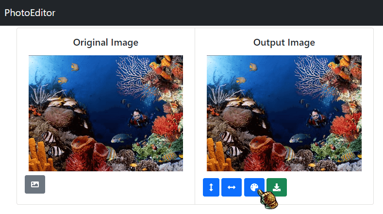

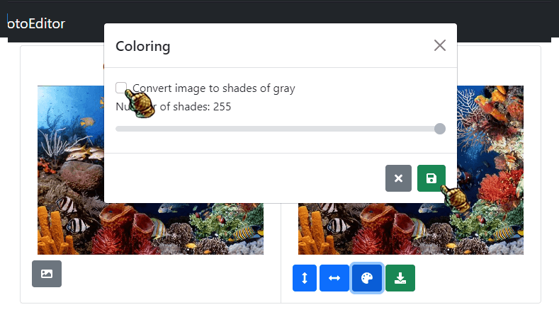

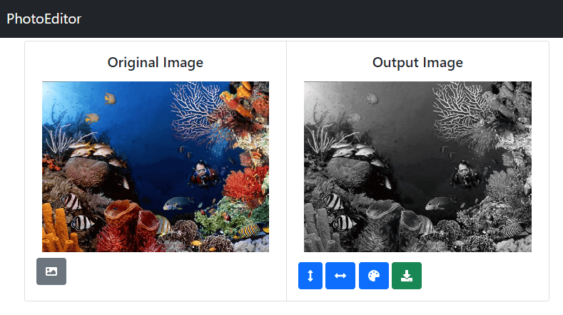

A implementação dessa funcionalidade foi bastante simples.

```typescript
// cria um array com o número de colunas
range(mat.cols)
  .flatMap((col) =>
    // cria um array com o número de linhas
    range(mat.rows).map((row) => ({ row, col }))
  )

  // itera por (coluna, linha)
  .forEach(({ col, row }) => {
    // pega o ponteiro de um pixel
    const ptr = mat.ucharPtr(row, col);

    // pega os valores rgb daquele pixel
    const [r, g, b, a] = [ptr[0], ptr[1], ptr[2], ptr[3]];

    // calcula o valor resultante do pixel
    const result = 0.299 * r + 0.587 * g + 0.114 * b;

    // altera o valor do pixel na  imagem
    ptr.set([result, result, result, a]);
  });
```

Diferente da funcionalidade de espelhamento horizontal e vertical, não encontrei um modo mais eficiente de realizar essa operação que não fosse pixel a pixel.

> Pergunta: o que acontecerá com uma imagem em tons de cinza (Ri = Gi = Bi = Li) caso o cálculo de luminância seja aplicado a ela?

```
resultado = 0.299 * r + 0.587 * g + 0.114 * b;
resultado = Li * (0.299 + 0.587 + 0.114)
resultado = Li * 1
resultado = Li
```

### Quantização (de tons) sobre as imagens em tons de cinza.

> Note que, neste caso, como a dimensão do espaço de cor é 1, tal processo de quantização se torna bastante simples.
> Assim, o seu programa deve receber como entrada o (máximo) número de tons a ser utilizados no processo de quantização.
> Para realização desta tarefa, sejam t1 e t2, respectivamente, os tons (presentes na imagem) com o menor e o maior valor de intensidade (i.e., luminância), e seja tam_int = (t2 - t1 + 1). Seja n o número de tons a ser utilizado no processo de quantização.
>
> Caso n >= tam_int, nenhuma quantização é necessária (há tons suficientes para representar a imagem com seus tons originais).
>
> No caso em que n < tam_int, o tamanho de cada bin é dado por tb = tam_int/n.
> Assim, o 1o bin corresponderá ao intervalo [t1-0.5, t1-0.5+tb), o segundo bin ao intervalo [t1-0.5+tb, t1-0.5+2tb), e assim sucessivamente.
>
> Para o processo de quantização, dado um tom t_orig de um pixel da imagem original, utilize como seu tom quantizado o valor inteiro mais próximo do centro do intervalo do bin que contém t_orig.

Em questão de UX, optei por juntar a opção de tons de cinza e quantidade de tons na mesma janela.

```typescript
// cria array de (linha, coluna)
range(mat.cols)
  .flatMap((col) => range(mat.rows).map((row) => ({ row, col })))

  // itera todos pixels
  .forEach(({ col, row }) => {
    const ptr = mat.ucharPtr(row, col);

    const [r, g, b, a] = [ptr[0], ptr[1], ptr[2], ptr[3]];
    const result = 0.299 * r + 0.587 * g + 0.114 * b;

    // calcula variância de cada tom
    const step = Math.floor((255 + 1) / coloringState.numberOfShades);

    // calcula qual o tom mais próximo
    const bucket = Math.floor(result / step);

    // calcula o valor do tom mais próximo
    const value = bucket * step;

    // aplica no pixel
    ptr.set([value, value, value, a]);
  });
```

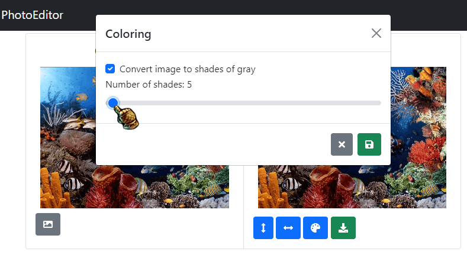
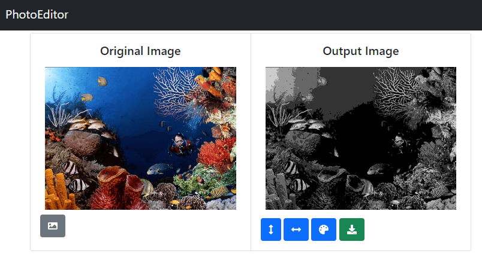

### Salvamento da imagem resultante das operações realizadas em um arquivo JPEG

> Disponibilize uma opção para salvar a imagem resultante das operações realizadas em um arquivo JPEG.


Como já mostrado na parte I, o download de imagens é relativamente simples em HTML.
